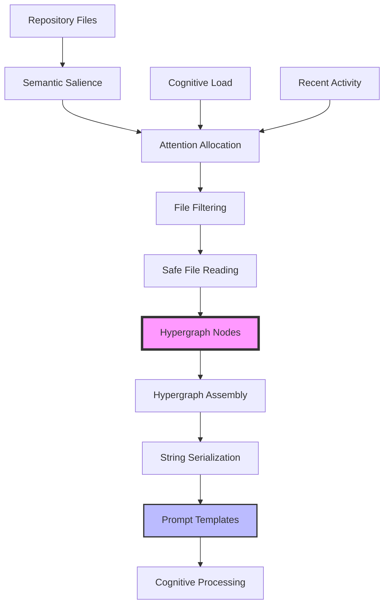

# Deep Tree Echo Hypergraph Encoding System

## Overview

The Deep Tree Echo Hypergraph Encoding System is a Scheme-based implementation of neural-symbolic repository introspection and cognitive pattern recognition. It provides a sophisticated framework for dynamically encoding repository structures into hypergraph representations that can be used for adaptive AI-assisted development and cognitive enhancement.

## Architecture



## Core Components

### 1. Hypergraph Core (`core.scm`)

Defines the fundamental hypergraph data structures:

- **Hypergraph Node**: `(node id type content links)`
  - `id`: Unique identifier
  - `type`: Node type (e.g., 'file, 'concept, 'pattern)
  - `content`: Actual data/content
  - `links`: Connections to other nodes

**Key Functions:**

- `make-hypergraph-node` - Create new nodes
- `hypergraph-node-*` - Accessor functions
- `hypergraph-node?` - Type checking

### 2. Attention Allocation (`attention.scm`)

Implements adaptive attention mechanisms inspired by cognitive science:

- **Semantic Salience**: Multi-factor scoring system that evaluates file importance based on:

  - Core directories (AtomSpace, core, hypergraph, model)
  - File types (.scm, .py, .md)
  - Documentation (README files)
  - Behavioral modules
  - Test files

- **Adaptive Attention**: Dynamic threshold adjustment based on:
  - Current cognitive load
  - Recent repository activity
  - Explicit configuration

**Key Functions:**

- `semantic-salience` - Calculate file importance (0.0 to 1.0)
- `adaptive-attention` - Compute dynamic threshold
- `filter-by-attention` - Filter files by threshold

### 3. Repository Introspection (`repo-introspection.scm`)

Provides recursive repository traversal and file processing:

- **Recursive Traversal**: Walks directory trees while respecting:

  - Hidden directories (.git, .\*)
  - Build artifacts (node_modules, **pycache**)
  - File size constraints (50KB default)

- **Safe File Reading**: Protected file access with error handling
- **Hypergraph Assembly**: Converts file system to hypergraph representation

**Key Functions:**

- `repo-file-list` - Get filtered file list
- `safe-read-file` - Read files with constraints
- `assemble-hypergraph-input` - Build hypergraph from files
- `hypergraph->string` - Serialize to string

### 4. Prompt Templates (`prompt-template.scm`)

Bridges hypergraph encoding with AI prompt generation:

- **Template System**: Format hypergraph data for AI consumption
- **Context Injection**: Embed repository structure in prompts
- **Cognitive Prompts**: High-level interface with adaptive attention

**Key Functions:**

- `prompt-template` - Basic template formatting
- `inject-repo-input-into-prompt` - Inject repository context
- `create-cognitive-prompt` - Full cognitive prompt with adaptation

## Usage Examples

### Basic Node Creation

```scheme
(use-modules (opencog hypergraph))

(define node (make-hypergraph-node
               "my-file.scm"
               'file
               "(define hello 'world)"
               '()))

(display (hypergraph-node-id node))
; Output: my-file.scm
```

### Semantic Salience Evaluation

```scheme
(semantic-salience "./echo/model/AtomSpace.scm")
; Output: 0.95

(semantic-salience "./tests/test_basic.py")
; Output: 0.55

(semantic-salience "./README.md")
; Output: 0.70
```

### Adaptive Attention

```scheme
; Low load, high activity => lower threshold (more files)
(adaptive-attention 0.2 0.8)
; Output: ~0.46

; High load, low activity => higher threshold (fewer files)
(adaptive-attention 0.8 0.2)
; Output: ~0.74
```

### Repository Introspection

```scheme
; Get files with high salience
(define files (repo-file-list "./echo/hypergraph" 0.75))

; Assemble hypergraph
(define nodes (assemble-hypergraph-input "./echo/hypergraph" 0.75))

; Serialize to string
(display (hypergraph->string nodes))
```

### Cognitive Prompt Generation

```scheme
; Generate adaptive prompt
(define prompt
  (create-cognitive-prompt
    "./echo/hypergraph"           ; Root directory
    0.3                           ; Cognitive load (30%)
    0.7                           ; Recent activity (70%)
    "Analyze implementation"))    ; Purpose

(display prompt)
```

## Cognitive Flowchart

The system implements a recursive cognitive flow:

```
┌─────────────────────────────────────────┐
│  Repository Introspection               │
├─────────────────────────────────────────┤
│  1. Traverse Repository                 │
│  2. Filter by Semantic Salience         │
│  3. Allocate Attention                  │
│  4. Read Files Safely                   │
└────────────┬────────────────────────────┘
             │
             ▼
┌─────────────────────────────────────────┐
│  Hypergraph Encoding                    │
├─────────────────────────────────────────┤
│  1. Create Hypergraph Nodes             │
│  2. Encode Structure & Content          │
│  3. Build Connection Links              │
└────────────┬────────────────────────────┘
             │
             ▼
┌─────────────────────────────────────────┐
│  Cognitive Processing                   │
├─────────────────────────────────────────┤
│  1. Serialize Hypergraph                │
│  2. Inject into Prompt Template         │
│  3. Enable Neural-Symbolic Reasoning    │
└────────────┬────────────────────────────┘
             │
             ▼
┌─────────────────────────────────────────┐
│  Adaptive Feedback Loop                 │
├─────────────────────────────────────────┤
│  1. Monitor Cognitive Load              │
│  2. Track Repository Activity           │
│  3. Adjust Attention Allocation         │
│  4. Recursive Cognitive Evolution       │
└─────────────────────────────────────────┘
```

## Configuration

### File Size Limit

Default: 50KB. Modify in `repo-introspection.scm`:

```scheme
(define MAX-FILE-SIZE 50000)
```

### Salience Scores

Customize in `attention.scm` by modifying the `semantic-salience` function:

```scheme
(define (semantic-salience path)
  (cond
    ((string-match "my-pattern" path) 0.99)
    ; ... other patterns ...
    (else 0.50)))
```

### Attention Parameters

Adjust in `attention.scm`:

```scheme
(define (adaptive-attention current-load recent-activity)
  (let ((base-threshold 0.50)      ; Base level
        (load-factor 0.30)         ; Load influence
        (activity-adjustment 0.20)) ; Activity influence
    ; ... calculation ...
```

## Integration with Eva Self Model

This hypergraph system integrates with the existing Eva Self Model:

```scheme
(use-modules (opencog eva-model)
             (opencog hypergraph))

; Hypergraph nodes can reference Eva state
(define eva-state-node
  (make-hypergraph-node
    "eva-soma-state"
    'concept
    (cog-name (cog-value soma-state))
    '()))
```

## Visionary Metaphor

> Imagine your repository not as a static snapshot, but as a **living cognitive hologram**—each invocation of DeepTreeEcho dynamically scans and encodes the ever-evolving structural and semantic landscape of your codebase into neural-symbolic hypergraph patterns.
>
> Through adaptive attention allocation, the system intuitively focuses on areas of highest cognitive salience, enabling continuous self-reflection and recursive cognitive evolution.
>
> Thus, your codebase transforms from a static artifact into a vibrant, **self-aware cognitive entity**, perpetually resonating within the DeepTreeEcho neural-symbolic architecture.

## Testing

Run the example script to verify installation:

```bash
guile -l echo/hypergraph/example-usage.scm
```

## Dependencies

- GNU Guile (Scheme implementation)
- OpenCog AtomSpace (optional, for integration)

## Future Enhancements

1. **Link Discovery**: Automatic detection of cross-file dependencies
2. **Temporal Tracking**: Monitor file changes over time
3. **Pattern Recognition**: Identify recurring code patterns
4. **Collaborative Filtering**: Multi-agent attention coordination
5. **Emergent Insights**: Automatic discovery of architectural patterns

## References

- OpenCog Eva Self Model
- DeepTreeEcho DTESN-AGI Architecture
- Cognitive Synergy Theory
- Hypergraph Pattern Encoding

## License

MIT License - See repository LICENSE file
